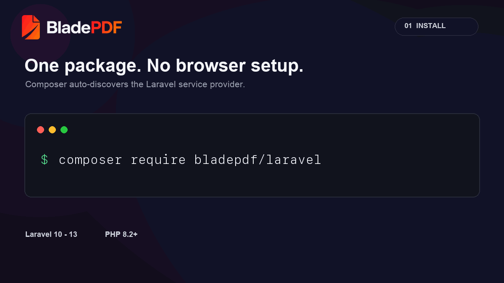
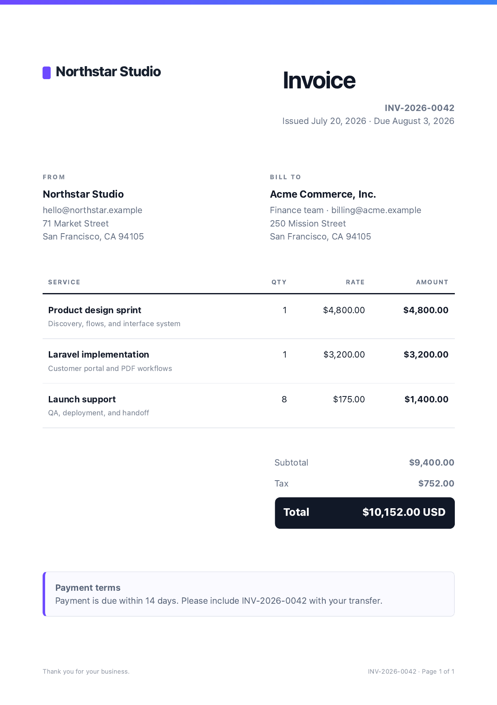
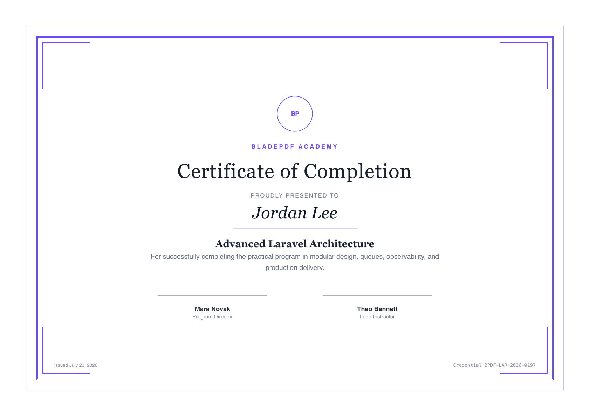
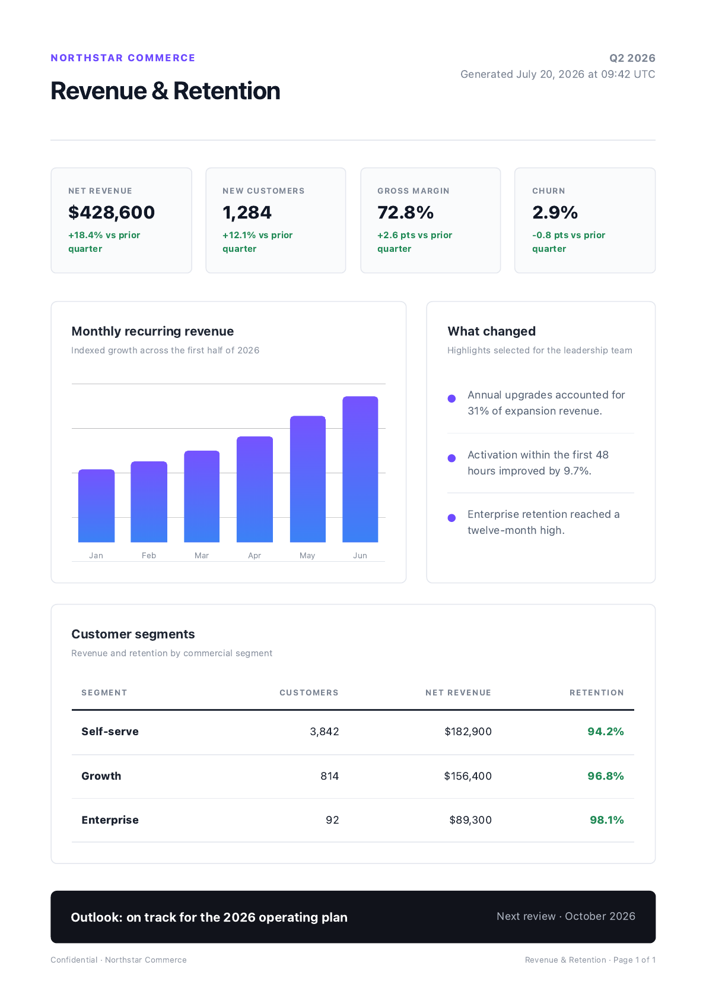

<p align="center">
  <a href="https://bladepdf.com">
    <picture>
      <source media="(prefers-color-scheme: dark)" srcset=".github/assets/bladepdf-logo-on-dark.webp">
      <source media="(prefers-color-scheme: light)" srcset=".github/assets/bladepdf-logo-on-light.webp">
      
    </picture>
  </a>
</p>

<h1 align="center">BladePDF for Laravel</h1>

<p align="center">
  <strong>Production-ready Laravel PDF generation from the Blade views you already use.</strong><br>
  Generate beautiful PDFs without installing Chromium, maintaining browser workers, or exposing local assets.
</p>

<p align="center">
  <a href="https://packagist.org/packages/bladepdf/laravel"></a>
  <a href="https://packagist.org/packages/bladepdf/laravel/stats"></a>
  <a href="https://packagist.org/packages/bladepdf/laravel"></a>
  
  <a href="LICENSE"></a>
  <a href="https://github.com/bladepdf/bladepdf-laravel/actions/workflows/ci.yml"></a>
  <a href="https://packagist.org/packages/bladepdf/laravel"></a>
</p>

<p align="center">
  
</p>

Browsershot and Puppeteer give you browser-level control. Spatie's Laravel PDF package gives you a choice of rendering drivers. **BladePDF is for Laravel teams that want the familiar Blade workflow while the browser lifecycle, asset uploads, concurrency, storage, and async delivery are managed for them.**

## Installation

Install the package:

```bash
composer require bladepdf/laravel
```

Add an [API key](https://app.bladepdf.com) to your environment:

```env
BLADEPDF_API_KEY=your_api_key
```

Configuration is auto-discovered. Publish it only when you need to change timeouts, retries, SSL verification, or asset resolution:

```bash
php artisan vendor:publish --tag=bladepdf-config
```

## Verify webhooks

Store the signing secret shown when you create a BladePDF webhook endpoint:

```env
BLADEPDF_WEBHOOK_SECRET=whsec_...
```

Then verify the request before decoding or processing its payload:

```php
use BladePDF\Webhooks\SignatureValidator;
use Illuminate\Http\Request;

public function handle(Request $request)
{
    abort_unless(SignatureValidator::isValid($request), 401);

    $event = $request->json()->all();

    // Handle the verified event...
}
```

The validator checks the signature against the exact raw request body and
rejects timestamps outside a five-minute tolerance by default. Pass a secret as
the second argument for a per-request webhook, or publish the configuration to
customize `webhook_tolerance`.

## Using Spatie Laravel PDF?

Install the dedicated driver to keep the `Spatie\LaravelPdf\Facades\Pdf` API while BladePDF provides the managed Chromium backend:

```bash
composer require bladepdf/spatie-laravel-pdf-driver
```

See the [Spatie Laravel PDF integration guide](https://docs.bladepdf.com/integrations/spatie-laravel-pdf) for default-driver configuration, supported options, queues, and compatibility notes.

## 30-second example

```php
use BladePDF\Laravel\Facades\BladePDF;

return BladePDF::fromView('pdf.invoice', ['invoice' => $invoice])
    ->render()
    ->download("invoice-{$invoice->number}.pdf");
```

That is the complete synchronous flow: BladePDF renders the local view, resolves referenced assets, generates the PDF, and returns a Laravel download response.

## Features

- ✅ Local Laravel Blade views and raw HTML
- ✅ Tailwind CSS, plain CSS, and print styles
- ✅ Local images, SVG, stylesheets, and custom fonts
- ✅ Automatic asset discovery and request-scoped uploads
- ✅ Headers, footers, backgrounds, and custom page sizes
- ✅ JavaScript rendering and external assets on supported plans
- ✅ Cloud Blade templates and hosted assets
- ✅ Stored PDFs with signed retrieval URLs
- ✅ Asynchronous rendering with signed webhooks
- ✅ Fluent Laravel API with typed result objects

## Why BladePDF?

Running Chromium is straightforward in development. Production adds browser installs, process crashes, memory pressure, security updates, queue capacity, and asset URLs that the renderer can actually reach.

| Operational concern | Self-hosted Chromium | BladePDF |
| --- | --- | --- |
| Chrome and Node installation | You install and pin them | Managed |
| Browser crashes | Your workers absorb them | Isolated from your app |
| Memory and process tuning | Your responsibility | Managed render capacity |
| Local CSS, images, and fonts | Expose or rewrite them | Discovered and uploaded automatically |
| Queue workers | Build and operate them | Async API with signed webhooks |
| Scaling | Add workers and replicas | Increase managed concurrency |
| Browser and security updates | Your maintenance window | Managed |
| Template operations | Build your own workflow | Local views plus cloud templates |

> Focus on generating PDFs instead of maintaining browser infrastructure.

BladePDF is a hosted API, so it requires network access and an API key. Choose a self-hosted driver when offline rendering, data locality, or low-level browser control is more important than operational simplicity.

## Example PDFs

Each example includes a production-quality Blade template, realistic sample data, a rendered preview, and a focused README.

| [Invoice](examples/invoice) | [Event ticket](examples/ticket) |
| --- | --- |
| [](examples/invoice) | [](examples/ticket) |
| [Certificate](examples/certificate) | [Business report](examples/report) |
| [](examples/certificate) | [](examples/report) |

## Documentation

<p align="center">
  <a href="https://docs.bladepdf.com"><strong>Read the full documentation →</strong></a>
</p>

Start with the [quickstart](https://docs.bladepdf.com/quickstart), then explore the [asset pipeline](https://docs.bladepdf.com/asset-pipeline), [Blade templates](https://docs.bladepdf.com/blade-templates), [async renders](https://docs.bladepdf.com/api/async-renders), and [webhooks](https://docs.bladepdf.com/api/webhooks).

## Supported features

| Feature | Supported | Notes |
| --- | :---: | --- |
| Local Blade templates | Yes | Render existing Laravel views with `fromView()` |
| Raw HTML | Yes | Send prepared markup with `fromHtml()` |
| Tailwind and plain CSS | Yes | Local stylesheets are resolved automatically |
| Images and SVG | Yes | Local files are uploaded per render; remote URLs are preserved |
| Custom fonts | Yes | WOFF2, OTF, TTF, and CSS `@font-face` references |
| Headers and footers | Yes | Blade views or raw HTML for local HTML renders |
| Backgrounds | Yes | Use `showBackground()` or `transparentBackground()` |
| Landscape and custom paper | Yes | A3/A4 and any width/height supported by Chromium |
| Page ranges and margins | Yes | Fluent helpers plus raw PDF options |
| JavaScript rendering | Yes | Available on supported plans |
| Async rendering | Yes | Stored PDFs plus a `202 Accepted` submission |
| Signed webhooks | Yes | `pdf.rendered` and `pdf.failed` delivery events |
| Cloud Blade templates | Yes | Publish templates in the dashboard and render by id |
| Stored PDFs | Yes | Retrieve the signed URL from the result or webhook |
| Laravel versions | 10-13 | PHP 8.2 or newer |

## License

BladePDF for Laravel is open-source software licensed under the [MIT License](LICENSE).
