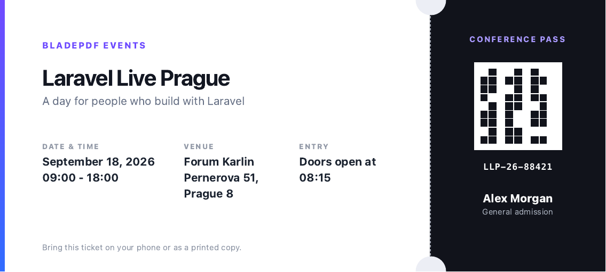

# Event ticket example

A compact landscape ticket with event details, attendee information, a machine-readable area, and print-safe tear-off styling.

```php
use BladePDF\Laravel\Facades\BladePDF;

$data = require resource_path('views/pdf/ticket/data.php');

return BladePDF::fromView('pdf.ticket.ticket', $data)
    ->paperSize(200, 90, 'mm')
    ->showBackground()
    ->render()
    ->download('event-ticket.pdf');
```

Replace the decorative QR block in the example with a real QR SVG or PNG in production.


